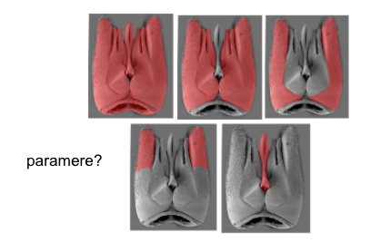
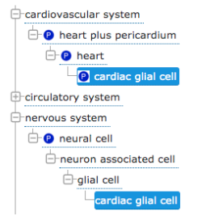
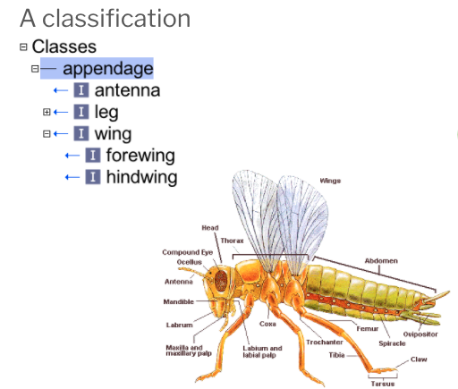
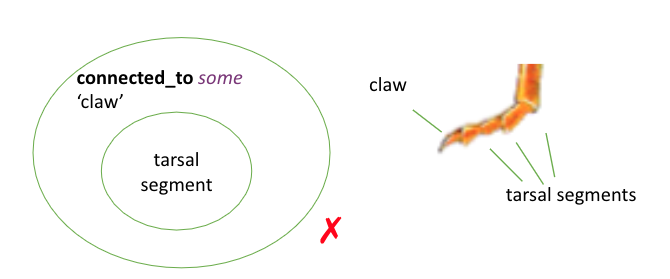
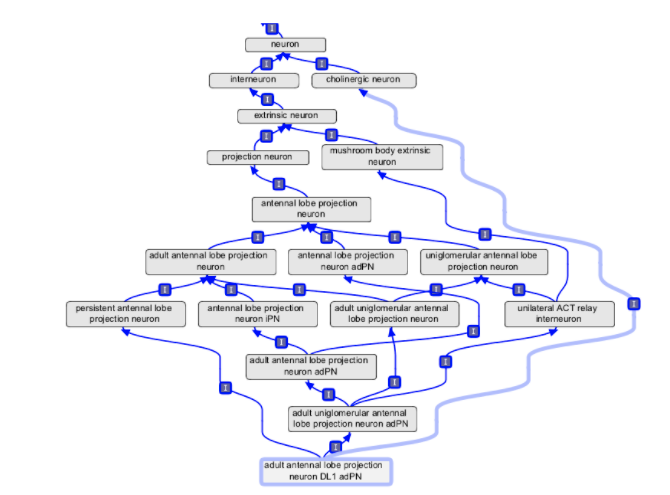
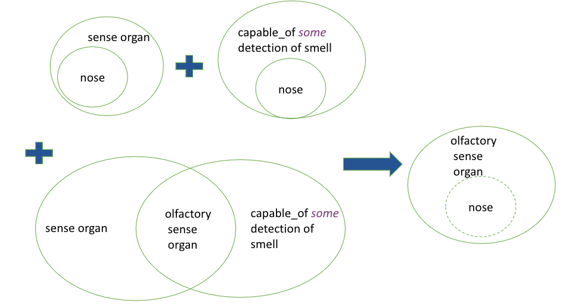

# Introduction to ontologies

Based on [CL editors training](https://docs.google.com/presentation/d/11WeCHCeGYSPEO7hUYFTdPivptxX4ajj5pVHDm24j4JA) by David Osumi-Sutherland

## Why do we need ontologies 

### We can't find what we're looking for
- Too flexible, multiple options, no enforcement standards 
    - standardized
    - quasi-standardized
    - non-standardized
- Data at varying depth or granularity

For example, trying to refer to feces, in NCBI BioSample:

| Query            | Records    |
| ---------------- | ---------- |
| Feces            | 22,592     |
| Faeces           | 1,750      |
| Ordure           | 2          |
| Dung             | 19         |
| Manure           | 154        |
| Excreta          | 153        |
| Stool            | 22,756     |
| Stool NOT faeces | 21,798     |
| Stool NOT feces  | 18,314     | 

### We don't know what we're talking about

Because we have no single reference glossary the result is millions of statements that are not obviously related
 
Here is the male genitalia of a gasteruptiid wasp, and these 5 different structures here have each been labeled "paramere" - by different people, studying different hymenopteran lineages - how do we know what "paramere" means when it is referred to? 



## Controlled vocabulary (CV)

### Definition

Any closed, prescribed list of terms.

### Key features

- Terms are not usually defined
- Relationships between the terms are not usually defined
- Simplest form is a list

### Example using wines

- Pinot noir
- Red
- Chardonnay
- Chianti
- Bordeaux
- Riesling

## Hierarchical Controlled vocabulary 

### Definition

Any controlled vocabulary that is arranged in a hierarchy.

### Key features

- Terms are not usually defined
- Relationships between the terms are not usually named or defined
- Terms are arranged in a hierarchy

### Example using wines (Taxonomy of wine)

- Red
    - Merlot
    - Zinfandel
    - Cabernet
    - Pinot Noir
- White
    - Chardonnay
    - Pinot Gris
    - Riesling

Taxonomy – a hierarchical CV in which hierarchy = classification

## Querying Hierachcical CV

The use of hierachical CV allows for querying with using inference from the hierarchy
For example:


## Being precisely vague 

Ontologies allow annotation at varying levels of precision:
e.g. Maybe the entity being annotated is a subtype of glial cell, but you don't know which, you can just annotate with 'glial cell'

### Polyhierarchy

Ontologies allow for polyhierarchies in which a term can have multiple relationship types and hence classified under multiple terms. Multiple relationship types are useful for grouping and being precisely vague. See example for cardiac glial cell: 



## What is an ontology? 

### Definition

- A queryable store of knowledge;
- A classification

### Key features

- Terms are defined
- Terms are richly annotated:
    - Textual definitions; references; synonyms, links, cross-references
- Relationships between terms are defined, allowing logical inference and sophisticated queries as well as graphs
- Terms are arranged in a classification hierarchy
- Expressed in a knowledge representation language such as RDFS, OBO, or OWL

### Example 

- Gene Ontology, Uberon, Cell Ontology, EFO, SNOMED

## non-logical parts of onotologies 

Terminology can be ambiguous, so text definitions, references, synonyms and images are key to helping users understand the intended meaning of a term. 


## Identifiers 

### Using non meaningful identifiers 

Identifiers that do not hold any inherent meaning are important to ontologies. If you ever need to change the names of your terms, you're going to need identifiers that stay the same when the term name changes.

For example: 

microgilal cells are also known as: hortega cell; microglia, microgliocyte, brain resident macrophage.
In the cell ontology, it is however refered to by a unique identifier: `CL:0000129`
These identifiers are short ways of referring to IRIs (e.g. CL:000129 = http://purl.obolibrary.org/obo/CL_0000129)
This IRI is a unique, resolvable identifier on the web.
A group of ontologies - loosely co-ordinated through the OBO Foundry, have standardised their IRIs (e.g. http://purl.obolibrary.org/obo/CL_0000129  - A term in the cell ontology; http://purl.oblibrary.org/obo/cl.owl - The cell ontology)

#### IRIs? URIs? URLs? 
- IRI: Internationalised Resource Identifier - a URI that can use characters in multiple languages
- URI: Unique Resource Identifier - is a string of characters, following a standard specification, that unambiguously identifies a particular (web) resource.
- URL: Uniform Resource Locator - a web-resolvable URI

## Building scalable ontologies

### Format

OBO ontologies are done mostly in OWL2 or OBO format.

For more indepth explanation of formats (OWL, OBO, RDF etc.) refer to explainer on [OWL format variants](../explanation/owl-format-variants.md)

### An ontology as a classification 

The ontology also functions as a classification.
Below you will see a classification of parts of the insect and how it is represented in the ontology.



We use a SubClassOf (or is_a in obo format) to represent entities that are fully encapsulated by the parent class.
For example: 
OWL: hindwing SubClassOf wing 
OBO: hindwing is_a wing


We use a relation `part_of` to represent an entity that is a part of a whole entity. 
For example: 
English: all (insect) legs are part of a thoracic segment
OWL: 'leg' SubClassOf part_of some thoracic segment
OBO: 'leg'; relationship: part_of thoracic segment
Note the existential quantifier `some` in OWL format - this means, that is interpreted as "there exists", "there is at least one", or "for some".


Note that there is a difference in how you order your subClassOf:
`'wing' SubClassOf part_of some 'thoracic segment'` is correct
`'thoracic segment' SubClassOf has_part some 'wing'` is incorrect as it implies all thoracic segment has wings on it. 

Similarly:
`'claw' SubClassOf connected_to some 'tarsal segment'` is correct
`'tarsal segment' SubClassOf  connected_to some 'claw'` is incorrect as it implies all tarsal segments are connected to claws (for example some tarsal segments are connected to other tarsal segments)



These relationships store knowledge in a queryable format. For more information about querying, please refer to guide on [DL queries](../tutorial/basic-dl-query.md) and [SPARQL queries](../tutorial/sparql.md)

### Scaling Ontologies

There are many ways to classify stuff - e.g. a neuron can be classified by strucutre, electrophysiology, neurotransmitter, lineage, etc. 

Manually maintaining these multiple inheriteance (that occur through multiple classifications) does not scale



Problems with maintaining multiple inheritance classifications by hand
- Doesn’t scale  
    - When adding a new class how are human editors to know
        - all of the relevant classifications to add?
        - how to rearrange the existing class hierarchy
- Is bad for consistency:
    - Reasons for existing classifications often opaque
    - Hard to check for consistency with distant superclasses
- Doesn’t allow for querying 
    - A formalized ontology can be queried for classes with arbitrary sets of properties.  A manual classification can not.

#### Automated Classifications

The knowledge an ontology contains can be used to automate classification
For example: 

English: Any sense organ that functions in the detection of smell is an olfactory sense organ
OWL: 
```
'olfactory sense organ'
 EquivalentTo ‘sense organ’ 
that 
capable_of some ‘detection of smell’
```

If we then have an entity `nose` that is subClassOf `sense organ` and `capable_of some detection of smell`, it will be automatically classified as an olfacotry sense organ.



## Acknowledgements
- David Osumi-Sutherland (original creator of slides)
- Nicole Vasilevsky (OSHU) Alex Diehl (Buffalo), Nico Matentzoglu 
- Chris Mungall (LNBL),  Melissa Haendal (OSU), Jim Balhoff (RENCI), James Overton - slides, ideas & discussions
- Terry Meehan  - who edited CL more than anyone 
- Helen Parkinson (EBI)
- Michael Ashburner

