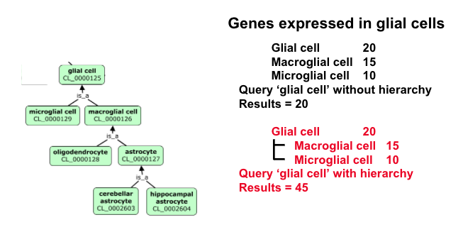
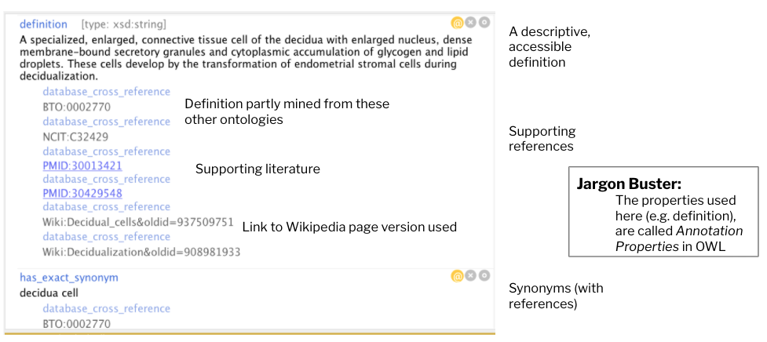

# Introduction to ontologies

Based on [CL editors training](https://docs.google.com/presentation/d/11WeCHCeGYSPEO7hUYFTdPivptxX4ajj5pVHDm24j4JA) by David Osumi-Sutherland

## Why do we need ontologies 

### We can't find what we're looking for
- Too flexible, multiple options, no enforcement standards 
    - standardized
    - quasi-standardized
    - non-standardized
- Data at varying depth or granularity

For example, trying to refer to feces, in NCBI BioSample:

| Query            | Records    |
| ---------------- | ---------- |
| Feces            | 22,592     |
| Faeces           | 1,750      |
| Ordure           | 2          |
| Dung             | 19         |
| Manure           | 154        |
| Excreta          | 153        |
| Stool            | 22,756     |
| Stool NOT faeces | 21,798     |
| Stool NOT feces  | 18,314     | 

### We don’t know what we’re talking about

Because we have no single reference glossary the result is millions of statements that are not obviously related
 
Here is the male genitalia of a gasteruptiid wasp, and these 5 different structures here have each been labeled "paramere" - by different people, studying different hymenopteran lineages - how do we know what "paramere" means when it is referred to? 

## Controlled vocabulary (CV)

### Definition

Any closed, prescribed list of terms.

### Key features

- Terms are not usually defined
- Relationships between the terms are not usually defined
- Simplest form is a list

### Example using wines

- Pinot noir
- Red
- Chardonnay
- Chianti
- Bordeaux
- Riesling

## Hierarchical Controlled vocabulary 

### Definition

Any controlled vocabulary that is arranged in a hierarchy.

### Key features

- Terms are not usually defined
- Relationships between the terms are not usually named or defined
- Terms are arranged in a hierarchy

### Example using wines (Taxonomy of wine)

- Red
    - Merlot
    - Zinfandel
    - Cabernet
    - Pinot Noir
- White
    - Chardonnay
    - Pinot Gris
    - Riesling

Taxonomy – a hierarchical CV in which hierarchy = classification

## Querying Hierachcical CV

The use of hierachical CV allows for querying with using inference from the hierarchy
For example:

## Being precisely vague 

Ontologies allow annotation at varying levels of precision:
e.g. Maybe the entity being annotated is a subtype of glial cell, but you don’t know which, you can just annotate with ‘glial cell’

### Polyhierarchy

Ontologies allow for polyhierarchies in which a term can have multiple relationship types and hence classified under multiple terms. Multiple relationship types are useful for grouping and being precisely vague. See example for cardiac glial cell: 

## What is an ontology? 

### Definition

- A queryable store of knowledge;
- A classification

### Key features

- Terms are defined
- Terms are richly annotated:
    - Textual definitions; references; synonyms, links, cross-references
- Relationships between terms are defined, allowing logical inference and sophisticated queries as well as graphs
- Terms are arranged in a classification hierarchy
- Expressed in a knowledge representation language such as RDFS, OBO, or OWL

### Example 

- Gene Ontology, Uberon, Cell Ontology, EFO, SNOMED

## non-logical parts of onotologies 

Terminology can be ambiguous, so text definitions, references, synonyms and images are key to helping users understand the intended meaning of a term. 

## Identifiers 

### Using non meaningful identifiers 

Identifiers that do not hold any inherent meaning are important to ontologies. If you ever need to change the names of your terms, you're going to need identifiers that stay the same when the term name changes.

For example: 

microgilal cells are also known as: hortega cell; microglia, microgliocyte, brain resident macrophage.
In the cell ontology, it is however refered to by a unique identifier: `CL:0000129`
These identifiers are short ways of referring to IRIs (e.g. CL:000129 = http://purl.obolibrary.org/obo/CL_0000129)
This IRI is a unique, resolvable identifier on the web.
A group of ontologies - loosely co-ordinated through the OBO Foundry, have standardised their IRIs (e.g. http://purl.obolibrary.org/obo/CL_0000129  - A term in the cell ontology; http://purl.oblibrary.org/obo/cl.owl - The cell ontology)

#### IRIs? URIs? URLs? 
- IRI: Internationalised Resource Identifier - a URI that can use characters in multiple languages
- URI: Unique Resource Identifier - is a string of characters, following a standard specification, that unambiguously identifies a particular (web) resource.
- URL: Uniform Resource Locator - a web-resolvable URI

## Building scalable ontologies

### Format

OBO ontologies are done mostly in OWL2 or OBO format.

For more indepth explanation of formats (OWL, OBO, RDF etc.) refer to explainer on [OWL format variants](../explanation/owl-format-variants.md)

### An ontology as a classification 

[NEED A GOOD WAY TO WRITE DOWN SLIDES 23-27 of https://docs.google.com/presentation/d/11WeCHCeGYSPEO7hUYFTdPivptxX4ajj5pVHDm24j4JA]

These relationships store knowledge in a queryable format

