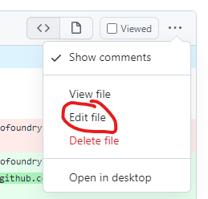
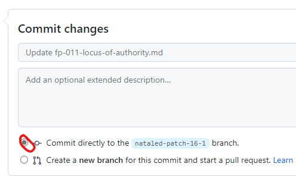

# How to change files in an existing pull request

## Using GitHub

Warning: You should only use this method if the files you are editing are reasonably small (less than 1 MB).

This method only works if the file you want to edit has already been editing as part of the pull request.

- Go to the pull request on GitHub, and click on the "Files Changed" tab up top
- Find the file you want to edit in the pull request.
- On the right, click on on the three `...`, and then "Edit file".

If this option is greyed out, it means that - you don't have edit rights on the repository - the edit was made from a different fork, and the person that created the pull request did not activate the "Allow maintainers to make edits" option when submitting the PR - the pull request has already been merged

- Do the edits, and then commit changes, usually to the same branch
  

## Using GitHub Desktop

1. On the pull request in GitHub, click the copy button next to the branch name (see example below)
1. In GitHub Desktop, click the branch switcher button and paste in branch name (or you can type it in).
1. Now you are on the branch, you can open the files to be edited and make your intended changes and push via the usual workflow.

### If the branch is on a fork

1. If a user forked the repository and created a branch, you can find that branch by going to the branch switcher button in GitHub Desktop and looking for that pull request
1. Select that pull request and edit the appropriate files as needed and push via the usual workflow.