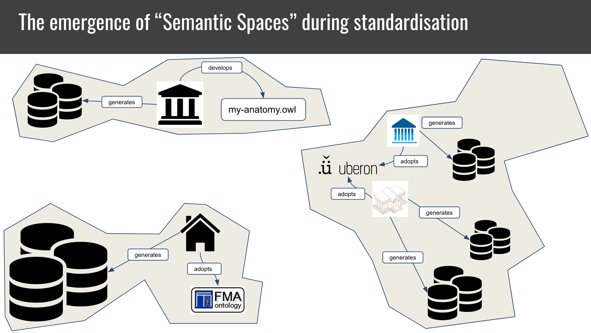
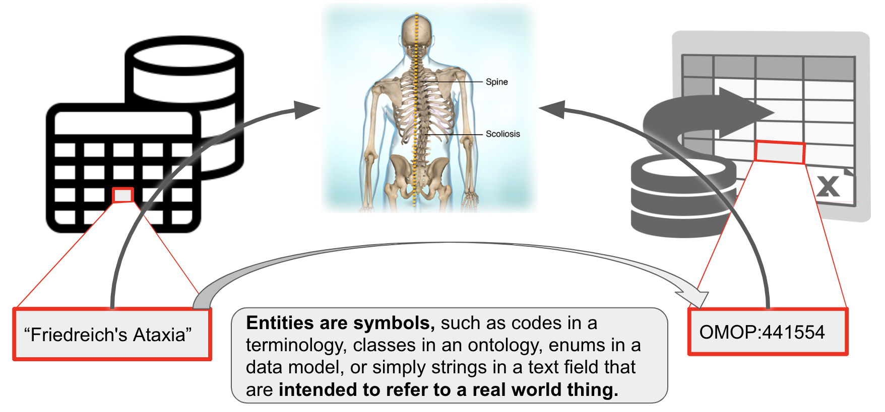
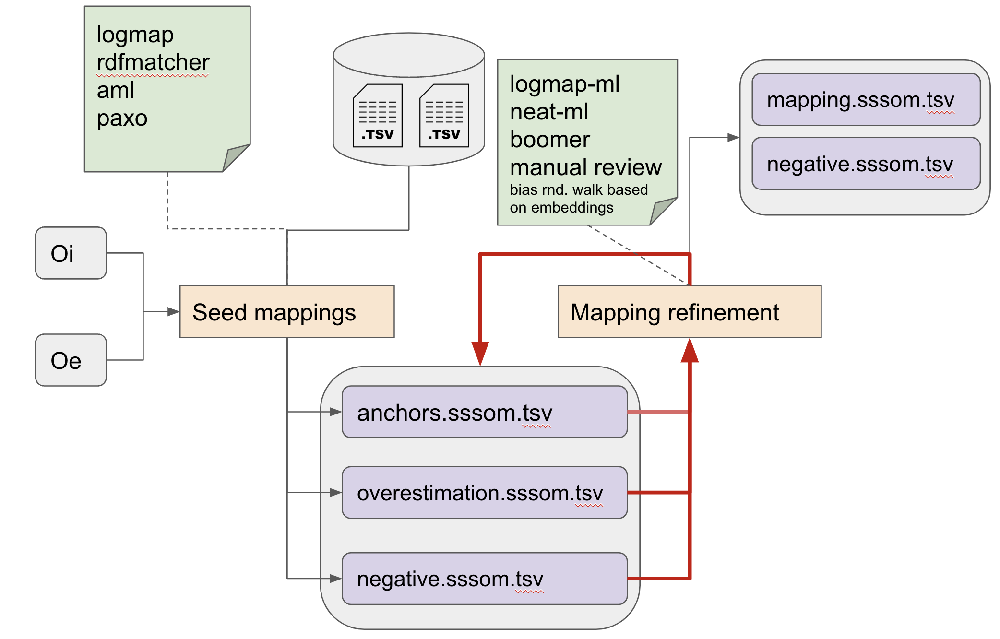

# Linking across vocabularies: Semantic Entity Matching

## Summary

All across the biomedical domain, we refer to domain entities (such as chemicals or anatomical parts) using identifiers, often from controlled vocabularies.

The decentralised evolution of scientific domains has led to to the emergence of disparate "semantic spaces" with different annotation practices and reference vocabularies and formalisms. 

To bridge between these spaces, entity mappings have emerged, which link, for example, genes from HGNC to ENSEMBL, diseases between OMIM and Mondo and anatomical entities between FMA and Uberon.

Entity matching is the process of establishing a link between an identifier in one semantic space to an identifier in another. There are many cultures of thought around entity matching, including Ontology Matching, Entity Resolution and Entity Linking.

## Table of Contents

- [Fundamentals](#fundamentals)
- [Basic tutorials](#basic)
- [Introduction to entity mapping](#introduction)
- [How are mappings collected in practice?](#collection)
- [A typical workflow for matching](#workflow)
- [Examples](#examples)

## Overview of the terminology

| Concept | Definition |
| --- | --- |
| Semantic space | A not widely used concept to denote a cluster of related data that can be interpreted using the same ontology. |
| Ontology matching | The task of determining corresponding entities across ontologies. |
| Entity mapping | Determining and documenting the correspondence of an entity in one semantic space to another. |
| Schema mapping | Determining and documenting the translation rules for converting an entity from one semantic space to another. |
| Ontology alignment | An ontology alignment is a set of term mappings that links all concepts in a source ontology to their appropriate correspondence in a target ontology, if any. |
| Knowledge graph matching | More or less the same as ontology matching - for knowledge graphs |
| Thesaurus building | Involves assigning natural language strings (synonym) to a code in a knowledge organisation system (like a taxonomy, terminology, or ontology) |
| Named Entity Recognition and Entity Linking | Involve recognising entities (such as diseases) in text and linking them to some identifier. |
| Entity resolution/record linkage | Involves determining if records from different data sources represent, in fact, the same entity |
| Schema matching | Determines if two objects from different data models (schema elements, schema instances) are semantically related. |
| Value Set Mapping | Determines and documents the correspondence of two [Value Sets](https://ecqi.healthit.gov/glossary/value-set) _and_ their respective values (i.e. a 2-level mapping!). |

## Fundamentals

The excellent [OpenHPI course on Knowledge Engineering with Semantic Web Technologies](https://open.hpi.de/courses/semanticweb2015) gives a good overview:

<iframe width="560" height="315" src="https://www.youtube.com/embed/VJHKcq_GuxY" title="YouTube video player" frameborder="0" allow="accelerometer; autoplay; clipboard-write; encrypted-media; gyroscope; picture-in-picture" allowfullscreen></iframe>

Another gentle overview on Ontology Matching was taught as part of the Knowledge & Data course at Vrije Universiteit Amsterdam. 

<iframe width="560" height="315" src="https://www.youtube.com/embed/gnq9I0OTjRo" title="YouTube video player" frameborder="0" allow="accelerometer; autoplay; clipboard-write; encrypted-media; gyroscope; picture-in-picture" allowfullscreen></iframe>

## Basic tutorials

1. [Mapping curation with SSSOM](../tutorial/sssom-tutorial.md)
1. [Introduction to processing mappings with SSSOM and sssom-py CLI](../tutorial/sssom-toolkit.md)
1. [Introduction to matching with OAK lexmatch](../tutorial/lexmatch-tutorial.md)

## Introduction to Entity Mapping

In the following, we consider a **entity** a *symbol that is intended to refer to a real world entity*, for example:

- an ontology id like OMOP:441554 corresponds to the concept of "Vascular calcification" in the real world. Note that OMOP:441554 may be annotated with the `rdfs:label` "Friedreichs Ataxia". 
The label itself is not necessarily a term - it could change, for example to "Friedreichs Ataxia (disease)", and still retain the same meaning.
- "`Friedreich's Ataxia`" (example on the left) may be a term in my controlled vocabulary which I understand to correspond to that respective disease (not all controlled vocabularies have IDs for their terms). 
This happens for example in clinical data models that do not use formal identifiers to refer to the values of slots in their data model, like "MARRIED" in /datamodel/marital_status.
- Examples of entities: 
  - IDs of classes in an ontology
  - elements of a clinical value set
  - elements of clinical terminologies such as [Z63.1](https://www.icd10data.com/ICD10CM/Codes/Z00-Z99/Z55-Z65/Z63-/Z63.1)
  - Elements of a schema
- TLDR: entities are symbols that correspond to things in the world, and that correspondence is _not subject to change_. 
Labels of such entities _can change without changing the meaning of the entity_.

In our experience, there are roughly four kinds of mappings:

- _string-string_: Relating one string, or label, to another string, or label. Understanding such mappings is fundamental to understanding all the other kinds of mappings.
- _string-entity: Relating a specific string or "label" to their corresponding entity in a terminology or ontology. We usually refer to these as synonyms, but there may be other words used in this case.
- entity-entity_: Relating an entity, for example a class in an ontology, to another entity. This is what most people in the ontology domain would understand when thy hear "ontology mappings".
- _complex mappings_: Relating two sets of entities. For example `cheese sandwich (wikidata:Q2734068)` to `sandwich (wikidata:Q111836983)` and `cheese wikidata:Q10943`.
 These are the rarest and most complicated kinds of mappings and are out of scope for this lesson.

In some ways, these four kinds of mappings can be very different. We do believe, however, that there are enough important commonalities such as common features, widely overlapping use cases and overlapping toolkits to consider them together. In the following, we will discuss these in more detail, including important features of mappings and useful tools.

### Important features of mappings

Mappings have historically been neglected as second-class citizens in the medical terminology and ontology worlds -
the metadata is insufficient to allow for precise analyses and clinical decision support, they are frequently stale and out of date, etc. The question "Where can I find the canonical mappings between X and Y"? is often shrugged off and developers are pointed to aggregators such as [OxO](https://www.ebi.ac.uk/spot/oxo/) or [UMLS](https://www.nlm.nih.gov/research/umls/knowledge_sources/metathesaurus/mapping_projects/index.html) which combine manually curated mappings with automated ones causing ["mapping hairballs"](#How-to-solve-the-problem-of-mapping-hairballs).

There are many important metadata elements to consider, but the ones that are by far the most important to consider one way or another are:

- _Precision_: Is the mapping exact, broad or merely closely related?
- _Confidence_: Do I trust the mapping? Was is done manually by an expert in my domain, or by an algorithm?
- _Source version_: Which version of the entity (or its corresponding ontology) was mapped? Is there a newer mapping which has a more suitable match for my entity?

Whenever you handle mappings (either create, or re-use), make sure you are keenly aware of at least these three metrics, and capture them. You may even want to consider using a proper mapping model like the [Simple Shared Standard for Ontology Mappings (SSSOM)](https://mapping-commons.github.io/sssom/5star-mappings/) which will make your mappings FAIR and reusable.

### String-string mappings
String-string mappings are mappings that relate two strings. The task of matching two strings is ubiquitous for example in database search fields (where a user search string needs to be mapped to some strings in a database). Most, if not all effective ontology matching techniques will employ some form of string-string matching. For example, to match simple variations of labels such as "abnormal heart" and "heart abnormality", various techniques such as [Stemming](https://en.wikipedia.org/wiki/Stemming) and [bag of words](https://en.wikipedia.org/wiki/Bag-of-words_model#:~:text=The%20bag%2Dof%2Dwords%20model,word%20order%20but%20keeping%20multiplicity.) can be employed effectively. Other techniques such as edit-distance or Levenshtein can be used to quantify the similarity of two strings, which can provide useful insights into mapping candidates.

### String-entity mappings / synonyms
String-entity mappings relate a specific string or "label" to their corresponding term in a terminology or ontology. Here, we refer to these as "synonyms", but there may be other cases for string-entity mappings beyond synonymy.

There are a lot of use cases for synonyms so we will name just a few here that are relevant to typical workflows of Semantic Engineers in the life sciences. 

[Thesauri](https://en.wikipedia.org/wiki/Thesaurus) are reference tools for finding synonyms of terms. Modern ontologies often include very rich thesauri, with some ontologies like Mondo capturing more than 70,000 exact and 35,000 related synonyms. They can provide a huge boost to traditional NLP pipelines by providing synonyms that can be used for both Named Entity Recognition and Entity Resolution. Some insight on how, for example, Uberon was used to boost text mining can be found [here](https://github.com/obophenotype/uberon/wiki/Using-uberon-for-text-mining).

### Entity-entity mappings / ontology mappings
Entity-entity mappings relate a entity (or identifier), for example a class in an ontology, to another entity, usually from another ontology or database. The entity-entity case of mappings is what most people in the ontology domain would understand when they hear "ontology mappings". This is also what most people understand when they here "Entity Resolution" in the database world - the task of determining whether, in essence, two rows in a database correspond to the same thing (as an example of a tool doing ER see [deepmatcher](https://github.com/anhaidgroup/deepmatcher), or [py-entitymatcher](https://pypi.org/project/py-entitymatching/)). For a list standard entity matching toolkit outside the ontology sphere see [here](https://www.biggorilla.org/software_cat/entity-matching/index.html). 

## How are mappings collected in practice?

Mappings between terms/identifiers are typically collected in four ways:

1. Automatically, using terminological matchers (of which ontology matchers one the most important category in our domain).
1. Manually, by dedicated curators.
1. By re-using existing mappings. Some semantic spaces have been mapped by organisations such as the [Monarch Initiative](https://monarchinitiative.org/) or [UMLS](https://www.nlm.nih.gov/research/umls/index.html), and it is often worth re-viewing existing mappings before building ones own.
1. Using a mix of automated and manual approaches, where automated approaches typically generate "mapping candidates" which are "double checked" by humans before used in production systems.

The main trade-off for mappings is very simple:
1. Automated mappings are _very_ error prone (not only are they hugely incomplete, they are also often faulty).
1. Human curated mappings are _very_ costly.

--> The key for any given mapping project is to determine the _highest acceptable error rate_, and then distribute the workload between human and automated matching approaches. We will discuss all three ways of collecting mappings in the following.

Aside from the main tradeoff above, there are other issues to keep in mind:
- Manually curated mappings are far from perfect. Most of the cost of mapping review lies in the decision _how thorough_ a mapping should be reviewed. For example, a human reviewer may be tasked with reviewing 1000 mappings. If the acceptable error rate is quite high, the review may simply involve the comparison of labels (see [here](../tutorial/sssom-tutorial.md)), which may take around 20 seconds. A tireless reviewer could possibly accept or dismiss 1000 mappings just based on the label in around 6 hours. Note that this is hardly better than what most automated approaches could do nowadays.
- Some use cases involve so much data that manual curation is nearly out of the question.

### Manual curation of mappings

It is important to remember that matching in its raw form should **not** be understood to _result in semantic mappings_. The process of _matching_, in particular lexical or fuzzy semantic matching is error prone and usually better treated as resulting in _candidates for mappings_. This means that when we calculate the effort of a mapping project, we should always factor in the often considerable effort required by a human to _verify the correctness of a candidate mapping_. There are many tools that can help with this process, for example by filtering out conflicting lower-confidence mappings, but in the end the reality is this: due to the fact that source and target do not share the same semantics, mappings will always be a bit wobbly. There are two important kinds of review which are very different:

1. False positive review (wrong mappings). The goal here is to identify mappings that do not work for our use case, or do not use the correct semantic mapping relation. For example `orange juice [wikidata:Q219059]` and `orange juice (unpasteurized) [FOODON:00001277]` may not be considered as the same thing in the sense of `skos:exactMatch`. 
1. False negative review (missing mappings). The goal here is to understand if we can do anything to improve the matching process by tuning it. For very simple matchers like `oak lexmatch` this usually involves hacking labels and synonyms by removing or replacing words. More sophisticated matchers like [Agreement Maker Light (AML)](https://github.com/AgreementMakerLight/AML-Project) have many more tuning options, and it requires patience and expertise to find the right ones. One good approach here is to include semantically or lexically similar matches in the results, and review if generally consistent patterns of lexical variation can be spotted.  For example: `orange juice (liquid) [FOODON:00001001]` seems to be exactly what `orange juice [wikidata:Q219059]` is supposed to mean. The labels are not the same, but lexically similar: a simple lexical distance metric like [Levenshtein](https://en.wikipedia.org/wiki/Levenshtein_distance) could have been used to identify these.

_Tip:_ always keep a clear visible list of unmapped classes around to sanity check how good your mapping has been so far.

### Automated matching

There are many (_many_) tools out there that have been developed for entity matching. A great overview can be found in Euzenats [Ontology Matching](https://link.springer.com/book/10.1007/978-3-642-38721-0). Most of the matchers apply a mix of lexical and semantic approaches.

As a first pass, we usually rely on a heuristic that an _exact match on the label_ is strong evidence that the two entities correspond to the same thing. Obviously, this cannot always be the case `Apple` (the fruit) and `Apple` (the company) are two entirely different things, yet a simple matching tool (like OAK `lexmatch`) would return these as matching. The reason why this heuristic works in practice is because we usually match between already strongly related semantic spaces, such as two gene databases, two fruit ontologies or two disease terminologies. When the context is narrow, lexical heuristics have a much lower chance to generate excessively noisy mappings.

After lexical matchings are created, other techniques can be employed, including syntactic similarity (match all entities which have labels that are more than 80% similar and end with `disease`) and semantic similarity (match all entities whose node(+graph)-embedding have a cosine similarity of more than 80%). Automated matching typically results in a large number of false positives that need to be filtered out using more sophisiticated approaches for mapping reconciliation.

## A typical workflow for matching

1. Collecting existing mappings
1. Generating mapping candidates using automated matchers (seed mappings)
1. Iteratively refining mappings while keeping track of
  - Anchor mappings (known correct mappings)
  - Overestimation mappings (mapping candidates)
  - Negative mappings (known false mappings, as deterimed by tools or human review)

The refinement step may involve automated approaches that are sensitive to the logical content of the sources involved (for example by ensuring that the result does not result in equivalence cliques, or unsatisfiable classes), but more often than not, human curators are employed to curate the mapping candidates generated by the various automated approaches.

## Some examples of domain-specific mapping of importance to the biomedical domain

### Phenotype ontology mappings
Mapping phenotypes across species holds great promise for leveraging the knowledge generated by Model Organism Database communities (MODs) for understanding human disease. There is a lot of work happening at the moment (2021) to provide standard mappings between species specific phenotype ontologies to drive translational research ([example](https://github.com/mapping-commons/mh_mapping_initiative/tree/master/mappings)). Tools such as [Exomiser](https://github.com/exomiser/Exomiser) leverage such mappings to perform clinical diagnostic tasks such as variant prioritisation. Another app you can try out that leverages cross-species mappings is the Monarch Initiatives [Phenotype Profile Search](https://monarchinitiative.org/analyze/phenotypes).

### Disease ontology mappings
Medical terminology and ontology mapping is a huge deal in medical informatics ([example](https://www.nlm.nih.gov/research/umls/knowledge_sources/metathesaurus/mapping_projects/index.html)). [Mondo](https://github.com/monarch-initiative/mondo) is a particularly rich source of well provenanced disease ontology mappings.

## Further reading

- A great overview can be found in ["Tackling the challenges of matching biomedical ontologies" (Faria et al 2018)](https://jbiomedsem.biomedcentral.com/articles/10.1186/s13326-017-0170-9)
- A yearly competition of ontology matching systems is held by the [Ontology Alignment Evaluation Initiative (OAEI)](https://oaei.ontologymatching.org/). The challenge [results](http://oaei.ontologymatching.org/2020/results/) are a useful guide to identifying systems for matching you may want to try.
- The most comprehensive work for anyone serious about entity matching is Euzenats [Ontology Matching](https://link.springer.com/book/10.1007/978-3-642-38721-0).
