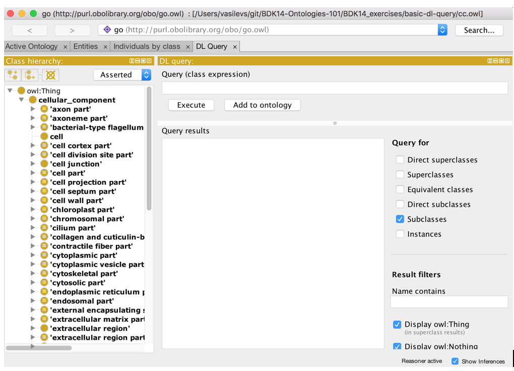
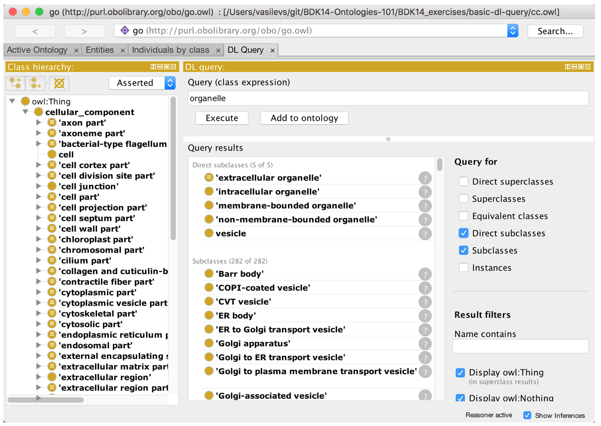
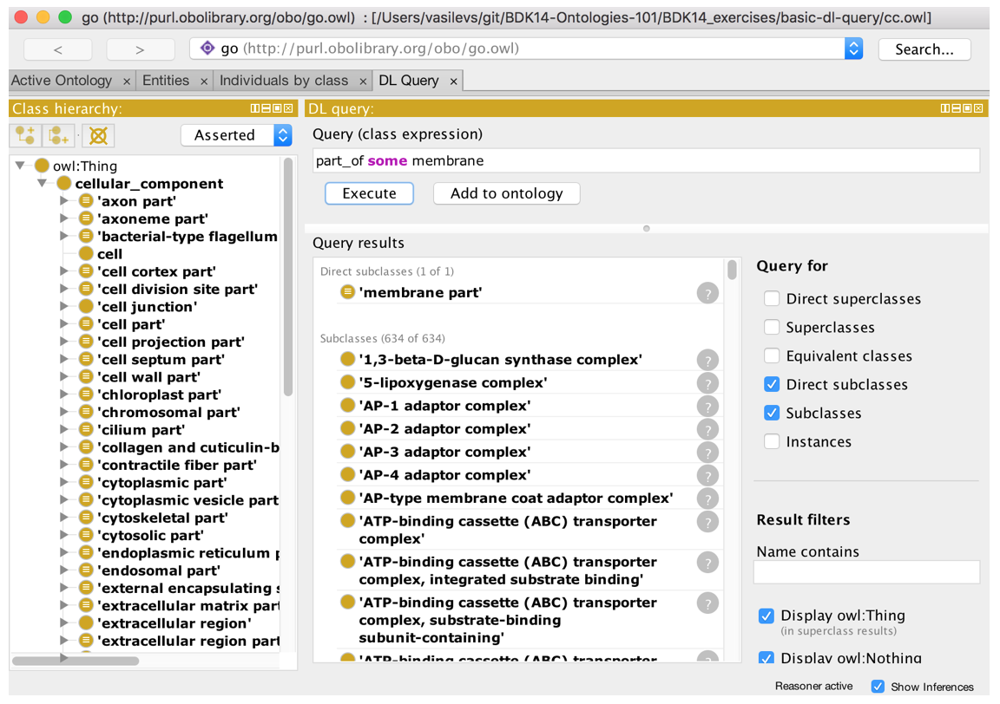
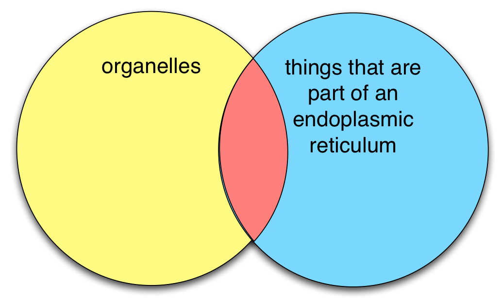
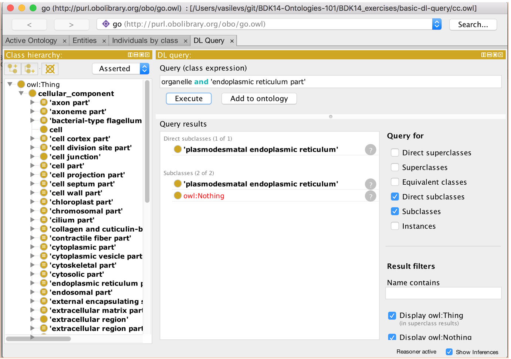
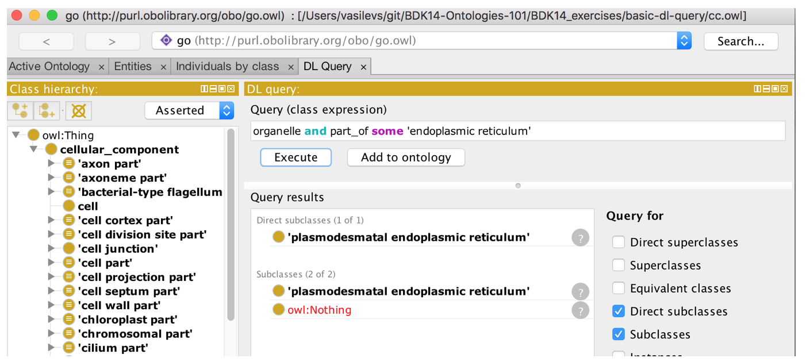
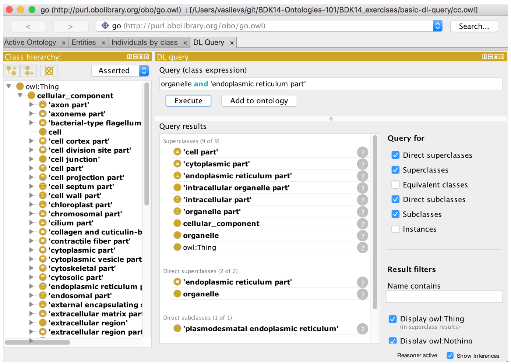
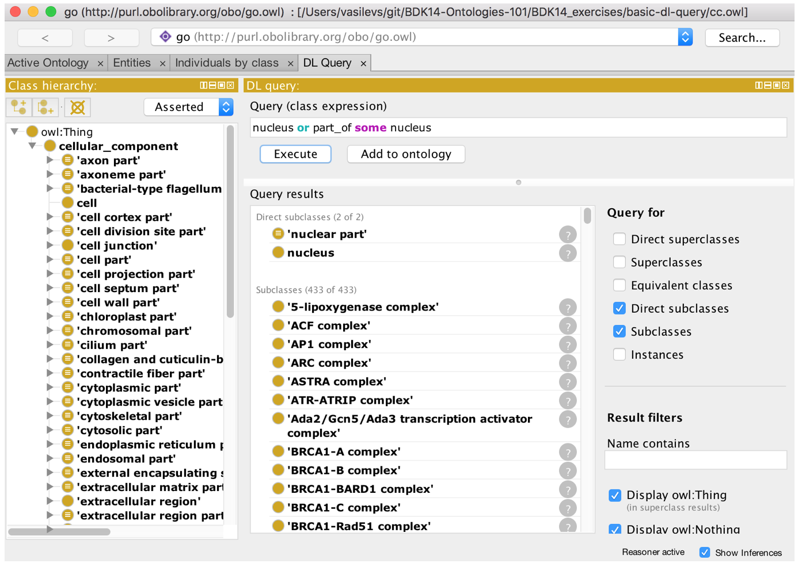
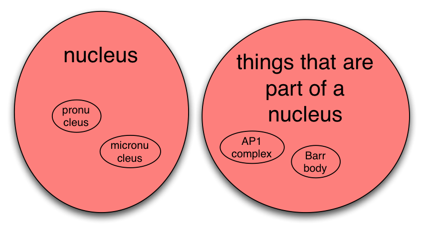

# DL query

This tutorial is based off https://ontology101tutorial.readthedocs.io/en/latest/DL_QueryTab.html
Created by: Melissa Haendel, Chris Mungall, David Osumi-Sutherland, Matt Yoder, Carlo Torniai, and Simon Jupp

## DL query tab

The DL query tab shown below provides an interface for querying and searching an ontology. The ontology must be classified by a reasoner before it can be queried in the DL query tab.

For this tutorial, we will be using cc.owl which can be found [here](resources/BDK14-exercises/basic-dl-query).

Go to the `basic-dl-query` folder and open `cc.owl`. Run the reasoner. Navigate to the DL Query tab.

Type `organelle` into the box, and make sure `subclasses` and `direct subclasses` are ticked.

You can type any valid OWL class expression into the DL query tab. For example, to find all classes whose members are part_of a membrane, type `part_of some membrane` and click `execute`. Note the linking underscore for this relation in this ontology. Some ontologies do not use underscores for relations, whereby you'd need single quotes (i.e. `part of`).

The OWL keyword `and` can be used to make a class expression that is the intersection of two class expressions. For example, to find the classes in the red area below, we want to find subclasses of the intersection of the class `organelle` and the class `endoplasmic reticulum part`

Note that we do not need to use the `part` grouping classes in the gene ontology (GO). The same results can be obtained by querying for the intersection of the class `organelle` and the restriction `part_of some ER` – try this and see.

We can also ask for superclasses by ticking the boxes as below:

The `or` keyword is to used to create a class expression that is the union of two class expressions. For example:

  
This is illustrated by the red area in the following Venn diagram:

For further exercises, please see https://ontology101tutorial.readthedocs.io/en/latest/EXERCISE_BasicDL_Queries.html